# VaanilaiAI (WeatherGPT)

<p align="center">
  
</p>

<p align="center">
  <strong>India-First Conversational Weather Intelligence & Disaster Resilience Platform</strong><br>
  <em>Calm, reliable, zero-hallucination meteorological intelligence for citizens, farmers, coastal fishers, and emergency response teams.</em>
</p>

<p align="center">
  <a href="https://vaanilai-ai.web.app"></a>
  <a href="https://vaanilai-ai-backend.onrender.com/docs"></a>
  <a href="https://flutter.dev"></a>
  <a href="https://fastapi.tiangolo.com"></a>
  <a href="https://ai.google.dev"></a>
</p>

---

## 🌐 Live Production Deployments

| Component | Provider / Platform | Live Endpoint URL | Status |
| :--- | :--- | :--- | :--- |
| **Web Application (Primary)** | **Firebase Hosting** | [https://vaanilai-ai.web.app](https://vaanilai-ai.web.app) | 🟢 Operational |
| **Web Application (Mirror)** | **Firebase Hosting** | [https://vaanilai-ai.firebaseapp.com](https://vaanilai-ai.firebaseapp.com) | 🟢 Operational |
| **Backend API (Swagger Docs)** | **Render Cloud** | [https://vaanilai-ai-backend.onrender.com/docs](https://vaanilai-ai-backend.onrender.com/docs) | 🟢 Operational |
| **Backend Health Check** | **Render Cloud** | [https://vaanilai-ai-backend.onrender.com/api/v1/health](https://vaanilai-ai-backend.onrender.com/api/v1/health) | 🟢 Operational |
| **Live Voice WebSocket** | **Render Cloud (WSS)** | `wss://vaanilai-ai-backend.onrender.com/api/v1/voice/live` | 🟢 Operational |
| **Android Release APK** | **GitHub Releases** | [Download VaanilaiAI-v1.0.0.apk](https://github.com/jinsu-2005/VaanillaiAI-WeatherGPT/releases/latest) | 🟢 Available |

> 📱 **Web Mobile View Tip**: To experience the responsive mobile layout in your desktop browser, right click anywhere, select **Inspect** (or press `F12` / `Ctrl + Shift + I`), then click the **Toggle device toolbar** (mobile/tablet devices icon) in the top-left corner of the DevTools console and choose a mobile device (such as Pixel 7 or iPhone 14 Pro).

---

## 📋 Table of Contents

- [1. System Architecture](#1-system-architecture)
- [2. Core Capabilities & Innovation](#2-core-capabilities--innovation)
- [3. Technology Stack](#3-technology-stack)
- [4. Project Structure](#4-project-structure)
- [5. Quick Start & Local Development](#5-quick-start--local-development)
- [6. Automated Verification & Testing](#6-automated-verification--testing)
- [7. Cloud Deployment](#7-cloud-deployment)
- [8. API Endpoints Reference](#8-api-endpoints-reference)
- [9. Security & Governance](#9-security--governance)

---

## 1. System Architecture

```mermaid
graph TD
    subgraph Client ["Client Tier (Flutter Mobile & Web)"]
        UI["Flutter Material 3 UI (Web & Mobile)"]
        Provider["State Management (Provider)"]
        WebAudio["Web Audio API Bridge (16kHz Mic + 24kHz Speaker)"]
        NativeAudio["Android Native AudioRecord / AudioTrack"]
        LocalCache["Coordinate Cache (15-min TTL)"]
        FAuth["Firebase Auth (Guest / Google / Email)"]
        Firestore["Cloud Firestore (Reports & Saved Locations)"]
        
        UI --> Provider
        Provider --> LocalCache
        Provider --> FAuth
        Provider --> Firestore
        UI --> WebAudio
        UI --> NativeAudio
    end

    subgraph Gateway ["API Gateway Tier (FastAPI on Render)"]
        FastAPI["FastAPI REST & WebSocket Engine"]
        AuthDep["Firebase JWT Token Verification"]
        CORS["CORS Middleware (Allowed Origins & Wildcard)"]
        RateLimit["Endpoint Rate Limiting"]
        
        FastAPI --> AuthDep
        FastAPI --> CORS
        FastAPI --> RateLimit
    end

    subgraph Intelligence ["Data & Intelligence Core"]
        Fusion["WeatherFusionEngine"]
        LiveBridge["Gemini Live Bidirectional Audio Bridge"]
        Cache["PostgreSQL / SQLite Cache (Async SQLAlchemy)"]
        GeminiPool["Google Gemini Multi-Key Failover Rotation"]
        HeatEngine["Steadman Heat Index & Stull Wet-Bulb Engine"]
        
        Fusion --> Cache
        Fusion --> GeminiPool
        Fusion --> HeatEngine
        LiveBridge --> GeminiPool
    end

    subgraph Upstream ["Meteorological & Disaster Authorities"]
        OpenMeteo["Open-Meteo High-Resolution NWP (ECMWF/GFS 2.5km)"]
        AirQuality["CAMS Global Atmospheric Monitoring (AQI/PM2.5)"]
        NDMA["NDMA Sachet CAP Disaster Warning Feed"]
        INCOIS["INCOIS Marine Ocean Forecasts & Potential Fishing Zones"]
        RainViewer["RainViewer Doppler Radar Tile Network"]
    end

    Provider -->|HTTPS REST| FastAPI
    WebAudio -->|WSS Live Audio Chunks| FastAPI
    NativeAudio -->|WSS Live Audio Chunks| FastAPI
    Provider -.->|Offline Direct Failover| OpenMeteo
    FastAPI --> Fusion
    FastAPI --> LiveBridge
    Fusion --> OpenMeteo
    Fusion --> AirQuality
    Fusion --> NDMA
    Fusion --> INCOIS
    UI --> RainViewer
```



---

## 2. Core Capabilities & Innovation

* **Zero-Hallucination Meteorology**: Never invents or hallucinates temperature, rainfall, or storm trajectories. Distinguishes live sensor telemetry from model projections and presents honest, informative offline/unavailable cards.
* **Biometeorological Labor Protection**: Real physical calculations of **Steadman’s Heat Index** ($HI$) and **Stull’s Wet-Bulb Temperature** ($T_w$) providing mandatory work-rest cycles and hydration protocols for farmworkers and outdoor laborers under extreme thermal stress.
* **Statutory Authority Badging**: Clear visual badges separating statutory government warnings (**IMD**, **NDMA Sachet**) from raw numerical weather prediction (NWP) model thresholds.
* **Bidirectional Gemini Live Spoken Voice**: Native bidirectional real-time audio interaction with sub-second latency. Supports **English**, **Tamil (தமிழ்)**, and **Hindi (हिन्दी)** with automatic speech recognition, live tool execution, and voice synthesis.
* **Cross-Platform Audio Architecture**: Seamlessly operates on native Android (via `AudioRecord` / `AudioTrack`) and web browsers (via `Web Audio API` + `getUserMedia` 16kHz resampling).
* **Multimodal Sky Vision AI**: Captures sky imagery to classify cloud genus (*Cumulonimbus*, *Nimbostratus*, *Altocumulus*, *Cirrus*) and estimate squall onset windows using Gemini Vision.
* **Agricultural & Coastal Marine Intelligence**: Micro-advisories for crop pesticide spraying windows (ICAR-GKMS), soil moisture tracking, wave surge alerts, and INCOIS Potential Fishing Zones (PFZ).
* **Crowdsourced Disaster Mapping**: Citizen reporting of waterlogging, downed power lines, and structural storm hazards stored in Cloud Firestore.

---

## 3. Technology Stack

### Frontend Client (`vaanilaiai/`)
* **Framework**: Flutter `3.38` (Dart SDK `^3.10.4`)
* **Platforms**: Web (Firebase Hosting SPA) & Mobile (Android / iOS)
* **Audio & WebSockets**: `web_socket_channel: ^3.0.3`, custom Web Audio API bridge (`voice_audio.js`), Android AudioRecord/AudioTrack
* **State Management**: `provider: ^6.1.2`
* **Maps & Visualizations**: `flutter_map: ^7.0.2`, `latlong2: ^0.9.1`, `fl_chart: ^0.69.0`
* **Typography & Icons**: `google_fonts: ^6.2.1`, `cupertino_icons: ^1.0.8`
* **Backend Authentication**: `firebase_core: ^3.6.0`, `firebase_auth: ^5.3.1`, `cloud_firestore: ^5.4.4`

### Backend Gateway & Services (`vaanilaiai/backend/`)
* **Framework**: FastAPI `>=0.115.0` (Python 3.12)
* **ASGI Server**: Uvicorn `>=0.30.0`
* **Generative AI Core**: Google GenAI SDK (`google-genai >=1.0.0`) with model rotation (`gemini-3.1-flash-lite`, `gemini-3.5-flash-lite`, `gemini-3.1-flash-live-preview`)
* **Database & ORM**: SQLAlchemy `>=2.0.35` with `aiosqlite` (local) and `asyncpg` (PostgreSQL production)
* **Physics & Math**: Psychrometric Wet-Bulb & Heat Index formulations (Stull, Steadman)

### Cloud Infrastructure
* **Frontend CDN**: Google Firebase Hosting (global SSD CDN with SSL)
* **Backend Worker**: Render Cloud Web Service (`render.yaml` blueprint)
* **Database**: Managed PostgreSQL on Render Cloud / SQLite fallback

---

## 4. Project Structure

```text
WeatherGPT/
├── .github/                    # CI/CD Workflows
├── render.yaml                 # Render Blueprint configuration
├── PROJECT_REPORT.md           # Comprehensive technical assessment report
├── models.txt                  # Verified Gemini models and quotas
├── vaanilaiai/                 # Main Application Subsystem
│   ├── .firebaserc             # Firebase project target (vaanilai-ai)
│   ├── firebase.json           # Firebase Hosting public rewrites & headers
│   ├── firestore.rules         # Security audited Firestore rules
│   ├── pubspec.yaml            # Flutter dependencies & metadata
│   ├── web/                    # Flutter Web application files
│   │   ├── index.html          # Web entry point
│   │   ├── voice_audio.js      # Web Audio API bridge (mic & speaker)
│   │   └── manifest.json       # PWA manifest
│   ├── lib/                    # Flutter Application Source Code
│   │   ├── main.dart           # App root & MultiProvider bootstrap
│   │   ├── firebase_options.dart # Platform Firebase configuration
│   │   ├── models/             # Strongly typed data models
│   │   ├── providers/          # Reactive ChangeNotifier state providers
│   │   ├── screens/            # 57 dedicated client screens
│   │   │   ├── main_navigation_screen.dart
│   │   │   ├── voice_weather_screen.dart # Live voice conversation
│   │   │   └── ...
│   │   ├── services/           # Network, API, and audio engines
│   │   │   ├── api_service.dart
│   │   │   ├── voice_audio_engine.dart
│   │   │   ├── web_audio_helper.dart      # Conditional web facade
│   │   │   ├── web_audio_helper_web.dart  # Dart JS-interop implementation
│   │   │   └── web_audio_helper_stub.dart # Native fallback stub
│   │   └── theme/              # Material 3 colors, typography, styles
│   └── backend/                # FastAPI Backend Service
│       ├── requirements.txt    # Python dependencies
│       ├── run.py              # Development launcher
│       ├── .env.example        # Environment variable template
│       ├── app/
│       │   ├── main.py         # FastAPI application entry & CORS
│       │   ├── core/           # Configuration, security, auth
│       │   ├── api/v1/         # Versioned REST & WebSocket routers
│       │   │   ├── weather.py  # NWP forecasts & alerts
│       │   │   ├── voice.py    # Gemini Live WebSocket endpoint
│       │   │   └── ...
│       │   ├── services/       # 44 micro-services & fusion engines
│       │   │   ├── voice_service.py # Real-time Live session manager
│       │   │   └── ...
│       │   └── schemas/        # Pydantic v2 validation models
│       └── tests/              # Pytest backend test suite
└── README.md                   # Repository documentation
```

---

## 5. Quick Start & Local Development

### Prerequisites
* **Flutter SDK**: `3.10` or higher ([Install Flutter](https://docs.flutter.dev/get-started/install))
* **Python**: `3.12` or higher ([Install Python](https://www.python.org/downloads/))
* **Firebase CLI**: `npx -y firebase-tools@latest`
* **Google Gemini API Key**: ([Obtain API Key](https://aistudio.google.com/))

### 1. Run the Backend (FastAPI)
```bash
cd vaanilaiai/backend

# Create and activate virtual environment
python -m venv venv
# Windows:
venv\Scripts\activate
# macOS/Linux:
source venv/bin/activate

# Install dependencies
pip install -r requirements.txt

# Configure environment
cp .env.example .env
# Open .env and add your GEMINI_API_KEY

# Start server
uvicorn app.main:app --host 0.0.0.0 --port 8000 --reload
```
Swagger UI will be live at: `http://localhost:8000/docs`.

### 2. Run the Frontend (Flutter Web or Mobile)
```bash
cd vaanilaiai

# Install Flutter packages
flutter pub get

# Run on Chrome (Web)
flutter run -d chrome

# Or run on connected Android device / emulator
flutter run -d android
```

---

## 6. Automated Verification & Testing

### Frontend Linting & Unit Tests
```bash
cd vaanilaiai
flutter analyze   # Strict static analysis (0 issues)
flutter test      # 30 passing unit and widget tests
```

### Backend Test Suite
```bash
cd vaanilaiai/backend
pytest -v         # Asynchronous integration & unit tests
```

---

## 7. Cloud Deployment

### Deploy Backend to Render
The repository includes a root [render.yaml](render.yaml) blueprint:
1. Connect this repository to your [Render Dashboard](https://dashboard.render.com).
2. Click **New** > **Blueprint**.
3. Select this repository.
4. Provide the environment variable `GEMINI_API_KEY` (or comma-separated `GEMINI_API_KEYS`).
5. Render automatically deploys the FastAPI container and provides a free HTTPS endpoint.

### Deploy Frontend to Firebase Hosting
```bash
cd vaanilaiai

# Build production web bundle pointing to your Render backend
flutter build web --release --dart-define=BACKEND_URL=https://vaanilai-ai-backend.onrender.com

# Deploy to Firebase Hosting
npx -y firebase-tools@latest deploy --only hosting
```

---

## 8. API Endpoints Reference

| Method | Endpoint | Description |
| :--- | :--- | :--- |
| `GET` | `/api/v1/health` | Health check & upstream provider status |
| `GET` | `/api/v1/weather/forecast` | 7-day high-resolution NWP forecast with AQI |
| `GET` | `/api/v1/weather/heat-stress` | Wet-Bulb labor safety & Steadman Heat Index |
| `GET` | `/api/v1/disaster/alerts` | Official NDMA & IMD CAP severe weather warnings |
| `GET` | `/api/v1/marine/ocean` | INCOIS wave height, tidal surge, and PFZ data |
| `POST` | `/api/v1/chat/message` | Multilingual conversational WeatherGPT agent |
| `POST` | `/api/v1/vision/sky-scan` | Multimodal cloud genus classification & rain ETA |
| `POST` | `/api/v1/voice/init` | Spoken session initialization with audio briefing |
| `WSS` | `/api/v1/voice/live` | Bidirectional Gemini Live 16kHz/24kHz PCM stream |

---

## 9. Security & Governance

* **Zero Hardcoded Secrets**: All sensitive API keys, database credentials, and service tokens are passed strictly through environment variables.
* **CORS Whitelisting**: CORS middleware explicitly whitelists trusted domains (`https://vaanilai-ai.web.app`, `https://vaanilai-ai.firebaseapp.com`, `http://localhost:*`).
* **Firebase Token Verification**: Incoming requests with `Authorization: Bearer <token>` are verified using cryptographic JWT inspection.
* **Firestore Security Rules**: Audited role-based access separating public warnings, private saved profiles, and user hazard reports.
