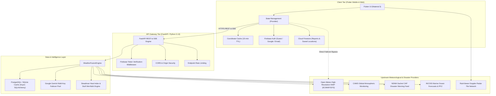

# VaanilaiAI (WeatherGPT)

> **India-First Conversational Weather Intelligence & Disaster Resilience Platform**  
> Serving everyday citizens, farmers, coastal fishers, and emergency response teams across the subcontinent with calm, reliable, zero-hallucination meteorological data.

---

## 🌐 Live Production Deployments

| Component | Platform | Live URL |
| :--- | :--- | :--- |
| **Web Application (Primary)** | Firebase Hosting | [https://vaanilai-ai.web.app](https://vaanilai-ai.web.app) |
| **Web Application (Mirror)** | Firebase Hosting | [https://vaanilai-ai.firebaseapp.com](https://vaanilai-ai.firebaseapp.com) |
| **Backend API (Swagger Docs)** | Render Cloud | [https://vaanilai-ai-backend.onrender.com/docs](https://vaanilai-ai-backend.onrender.com/docs) |
| **Backend Health Check** | Render Cloud | [https://vaanilai-ai-backend.onrender.com/api/v1/health](https://vaanilai-ai-backend.onrender.com/api/v1/health) |

---

## 1. System Architecture



---

## 2. Core Capabilities

* **Honest, Zero-Hallucination Meteorology**: Never presents simulated numbers as real official telemetry. Displays clear, informative unavailable cards with retry actions when sensor networks are unreachable.
* **Heat Stress & Wet-Bulb Labor Safety**: Real psychrometric calculation of Steadman’s Heat Index ($HI$) and Stull’s Wet-Bulb temperature ($T_w$) delivering actionable work-rest intervals and hydration directives for agricultural and manual laborers.
* **Official vs. Forecast Risk Distinctions**: Clear visual badging distinguishing official **IMD / NDMA** government bulletins from **NWP Model Risk** threshold guidance.
* **Astronomical Synodic Lunar Tracking**: Accurate lunar phase age, illumination fraction, and 12-hour AM/PM solar tracking.
* **Multimodal Sky Vision AI**: Captures optical cloud patterns to classify cloud genus (Cumulonimbus, Nimbostratus, Altocumulus, Cirrus) and estimate squall onset windows using Gemini Vision.
* **Multilingual Grounded WeatherGPT**: Natural language chat grounded in Open-Meteo model physics and ICAR-GKMS crop advisories in English, Tamil, and Hindi.
* **Live Doppler Radar & Citizen Hazard Reports**: Interactive animated radar reflectance overlay with crowdsourced waterlogging and storm damage reporting.

---

## 3. Technology Stack

### Mobile Frontend (`vaanilaiai/`)
* **Framework**: Flutter SDK `^3.10.4` (Dart)
* **State Management**: `provider: ^6.1.2`
* **Visuals & Charts**: `fl_chart: ^0.69.0`, `google_fonts: ^6.2.1`
* **Maps & Radar**: `flutter_map: ^7.0.2`, `latlong2: ^0.9.1`
* **Cloud & Auth**: `firebase_core: ^3.6.0`, `firebase_auth: ^5.3.1`, `cloud_firestore: ^5.4.4`
* **Quality**: `flutter_test` (30 passing tests), `flutter_lints` (0 issues)

### Backend API (`vaanilaiai/backend/`)
* **Framework**: FastAPI `>=0.115.0`
* **Server**: Uvicorn ASGI `>=0.30.0`
* **ORM & Database**: SQLAlchemy `>=2.0.35` with `aiosqlite` (local) and `asyncpg` (PostgreSQL production)
* **AI & LLMs**: `google-genai >=1.0.0` with `gemini-3.1-flash-lite`, `gemini-3.5-flash-lite`, and multi-key failover rotation
* **Quality**: `pytest` & `pytest-asyncio` (18+ passing tests)

---

## 4. Quick Start & Local Setup

### Prerequisites
* Flutter SDK (3.10+)
* Python 3.12+
* Git

### Backend Setup
```bash
cd backend
python -m venv venv
source venv/bin/activate  # Windows: venv\Scripts\activate
pip install -r requirements.txt
cp .env.example .env

# Run FastAPI Development Server
uvicorn app.main:app --host 0.0.0.0 --port 8000 --reload
```
API Documentation will be live at: `http://localhost:8000/docs`.

### Mobile Frontend Setup
```bash
# In the root vaanilaiai directory
flutter pub get

# Run on Chrome / Connected Device
flutter run
```

---

## 5. Automated Verification & Testing

### Flutter Test Suite
```bash
flutter analyze  # Strict lint and type check (0 issues)
flutter test     # 30 passing unit and widget tests
```

### Backend Test Suite
```bash
cd backend
pytest           # Comprehensive async test suite
```

---

## 6. Production Deployment (Render)

This repository includes a consolidated [render.yaml](render.yaml) blueprint configuring:
1. **Managed PostgreSQL Service**: Persistent relational storage for caching, multi-turn chat sessions, and disaster alerts.
2. **FastAPI Web Service**: Non-blocking asynchronous Python web worker automatically connected to the database via `DATABASE_URL`.

To deploy:
1. Connect this repository to your **Render** dashboard.
2. Choose **New Blueprint Instance**.
3. Supply your `GEMINI_API_KEY` (or comma-separated `GEMINI_API_KEYS` for quota failover).
4. Render automatically provisions the PostgreSQL database and deploys the backend container.

---

## 7. Security & Environment Governance

* **No Hardcoded Secrets**: All secrets and API keys are strictly loaded via `.env` or system environment variables.
* **CORS Restrictions**: Configured via `ALLOWED_ORIGINS` to prevent unauthorized browser cross-origin requests.
* **Token Verification**: Backend validates incoming Firebase ID tokens (`Authorization: Bearer <token>`) to ensure user identity.
* **Audited Firestore Rules**: Role-based read/write access control separating public alerts, private user profiles, and citizen ground hazard reports.
